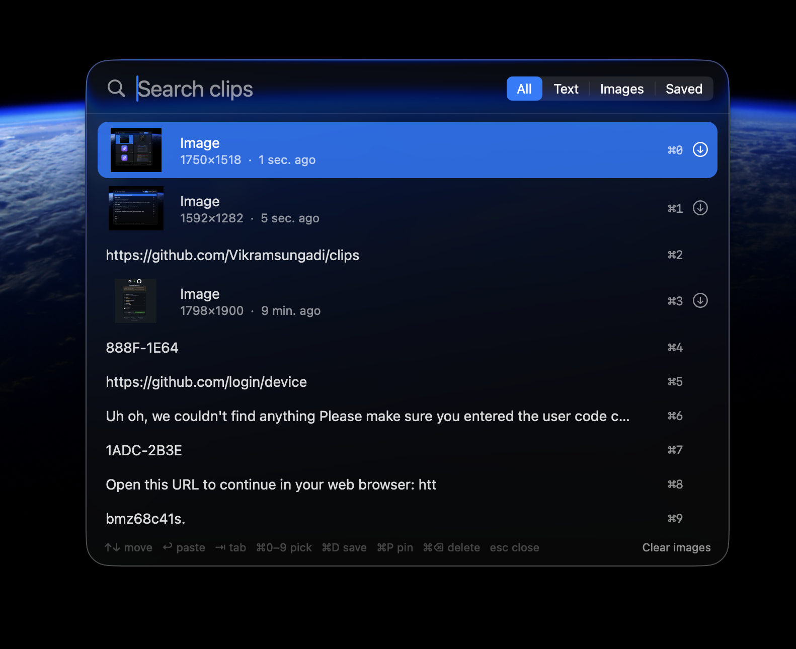
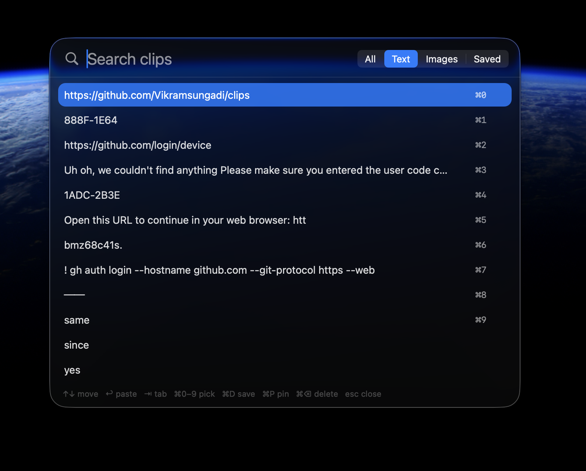
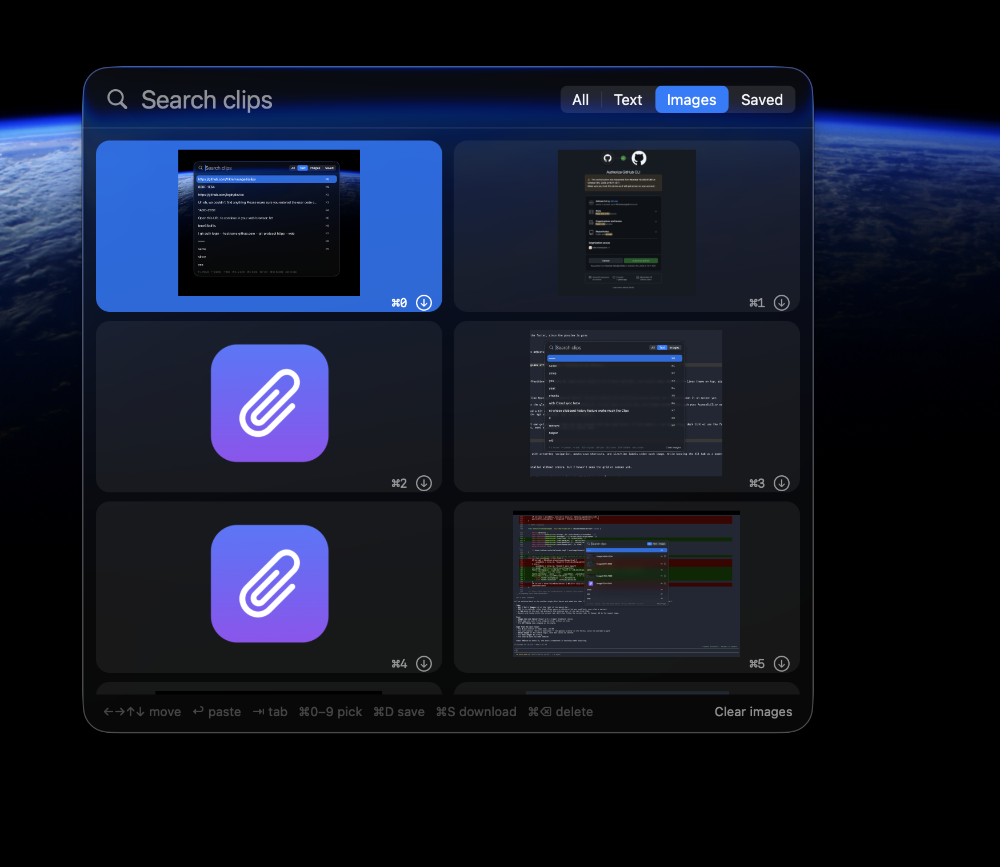
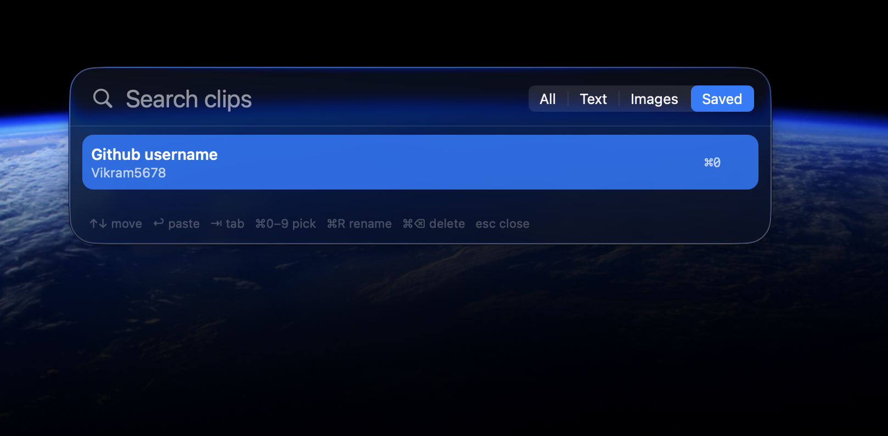
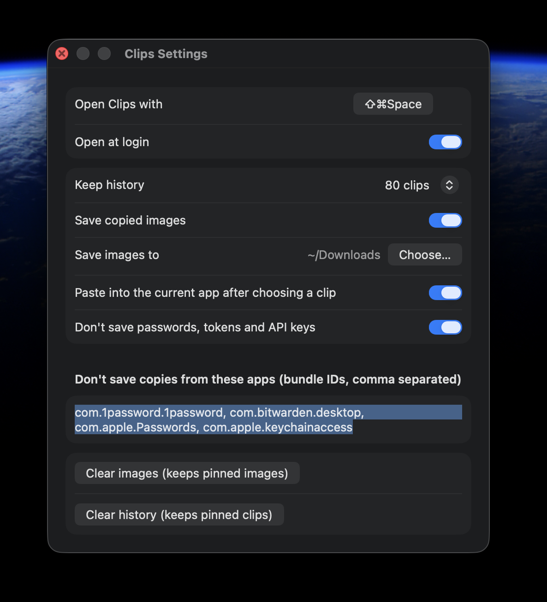

# Clips

A fast, keyboard-first clipboard history for macOS, with a Spotlight-style panel and Liquid Glass on macOS 26.

<p align="center"></p>

## Screenshots

| | |
|---|---|
| <br>**All**: everything you copied, newest first | <br>**Text**: just text, ⌘0–9 to paste |
| <br>**Images**: screenshots in a 2-column grid | <br>**Saved**: named clips, kept forever |
| <br>**Settings**: shortcut, history size, privacy | |

## Features

- **⇧⌘Space** (changeable) or the 📎 menu bar icon opens the panel in the middle of the screen, including over full-screen apps
- **Tabs: All, Text, Images, Saved.** The last tab you used is remembered. **⇥** switches tabs
- **Search** as you type
- **↩** pastes straight into the app you were using, and **⌘0–9** picks a clip quickly
- **Images**: screenshots and copied images are kept, and the Images tab shows them as a 2-column grid. **⌘S** or ⬇ downloads an image to a folder you choose
- **Saved**: **⌘D** names a clip and keeps it forever. **⌘R** renames it
- **⌘P** pins a clip to the top of history, and **⌘⌫** deletes it
- **Privacy**: skips passwords marked by password managers, text that looks like an API key or token (GitHub, OpenAI, AWS, Slack, private keys), and apps you list in Settings
- Opens at login. History size, image saving, auto-paste and the shortcut are all set in Settings (**⌘,**)

## Install

1. Download `Clips.zip` from [Releases](../../releases) and unzip it.
2. Move `Clips.app` to `/Applications`.
3. The app is not notarized by Apple, so the first time you open it, **right-click → Open → Open**. If macOS still blocks it, run:
   ```sh
   xattr -dr com.apple.quarantine /Applications/Clips.app
   ```
4. To paste straight into apps, allow Clips in **System Settings → Privacy & Security → Accessibility** when it asks.

Requires macOS 14 or later.

## Build from source

```sh
./build.sh
```

This compiles `Sources/*.swift` with `swiftc` (no Xcode project needed), makes the icon, signs the app, installs it to `/Applications` and restarts it. Requires the Xcode command line tools.

Data is stored in `~/Library/Application Support/Clips/`.
